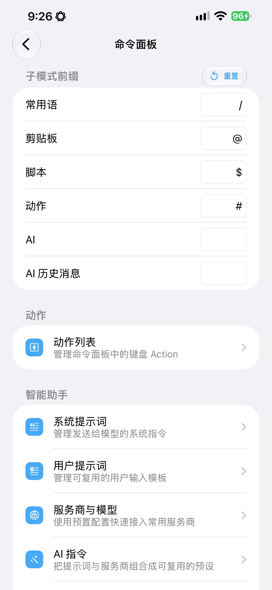
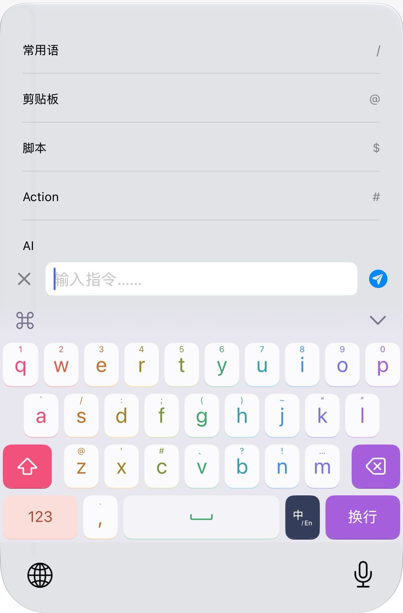
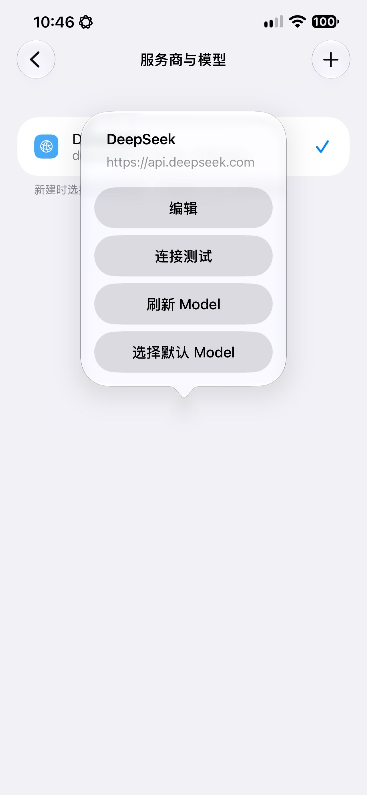

:::tip[注意]
此功能需要购买元书 Pro 后才能使用。
:::

import { Aside } from "@astrojs/starlight/components";

命令模式是键盘中的统一功能面板。它可以搜索并执行**常用语、剪贴板、脚本和键盘动作**，也可以直接使用 AI、恢复历史 AI 会话。整个过程无需离开当前正在输入的 App。

<Aside title="注意" type="caution">
- 此功能需要开启键盘**完全访问**权限，否则命令面板无法打开，AI 指令也无法发出请求。
- TF >= 496，商店 >= 1.8.0
</Aside>

{/* 截图建议：将命令面板首页截图保存为 images/command-mode/01-home.png，再取消下一行注释。 */}
{/*  */}


## 一、打开命令面板

命令面板快捷指令 `#toggleCommandView`。

```json
{
  action: { shortcut: "#toggleCommandView" },
}
```

首此执行可打开命令面板，再次执行该快捷指令即可关闭面板。

关闭后，键盘会恢复普通输入状态；正在运行的脚本或 AI 任务会被停止。

<Aside title="找不到命令面板？" type="tip">
可在工具栏菜单，应用菜单设置页面中新增一个命令面板的入口项
</Aside>

## 二、认识首页与子模式

键盘打开命令面板后，在输入框中输入特定前缀，可进入命令子模式：

| 子模式 | 默认前缀 | 搜索内容 | 执行结果 |
| --- | --- | --- | --- |
| 常用语 | `/` | 标题、正文和标签 | 将所选的常用语写入宿主 App（宿主 App 指打开键盘的应用，下同） |
| 剪贴板 | `@` | 剪贴板中的文本 | 将所选的文本写入当前宿主 App；注意：图片不参与搜索 |
| 脚本 | `$` | 脚本名称和标签 | 执行脚本，将返回脚本返回内容写入宿主 App |
| 动作 | `#` | 动作名称与别名 | 执行配置中的 Action |
| AI 历史 | 面板入口 | 会话标题和用户输入 | 打开完整会话并继续交流 |
| AI | 面板入口 | 用户输入 | 使用当前 AI 配置创建会话 |

进入子模式后：

- 空查询会显示默认列表，并自动选中第一项；
- 输入文字会进行模糊搜索，完整匹配和前缀匹配优先；
- 点击条目会立即执行；也可以点击**确定**按键，此时会执行首个条目；



<Aside title="快速进入 AI 子模式" type="tip">
在输入不匹配任何前缀的内容后，点击确认按键会直接进入 AI 子模式，并发送输入内容给 Provider 提供商。
</Aside>

## 三、自定义子模式前缀

进入元书 App 的**命令面板**页面，在“子模式前缀”区域可以分别修改：

- 常用语前缀；
- 剪贴板前缀；
- 脚本前缀；
- 动作前缀；
- AI 前缀；
- AI 历史前缀。

注意：

- 每个前缀必须唯一，不能与其他子模式重复。
- 出现冲突时输入框会变红，且不会保存。
- 点击标题栏中的**重置**可恢复默认前缀。

## 四、使用子模式功能

### 常用语

输入常用语前缀后，或者点击常用语，进入常用语子模式。

此时继续输入文字，可按标题、正文或标签搜索。

点击确认按键执行，会上屏首个匹配常用语，在成功写入后命令面板会自动关闭。

### 剪贴板

输入剪贴板前缀后，或者点击剪贴板，进入剪贴板子模式。

此时继续输入文字，可搜索已保存的文本记录。

匹配的剪贴板内容，会按：收藏优先显示，其余内容按更新时间排列。

> 注意：命令模式下的剪贴板，只展示文本类型剪贴板，不展示图片。

### 脚本

输入脚本前缀后，或者点击脚本，进入脚本子模式。

此时输入文字，可按名称或标签搜索脚本。

注意：

- 脚本子模式下，输入框的文字只用于查找脚本，不会作为 `$searchText` 参数传入，即 `$searchText` 变量在命令模式下永远为空；
- 脚本仍可按自身权限使用 `$selectedText`、系统剪贴板内容等变量。

### 动作

动作模式用于从命令面板执行键盘能力，键盘按键所有的 Action 都可以配置并执行。

动作支持名称和别名搜索，你除了为 Action 设置一个名字外，还可设置一个别名，方便在命令面板中快捷筛选并执行。

## 五、配置动作

在元书 App 中进入**命令面板 → 动作列表**，可以管理命令面板显示的动作。

### 新建与编辑

点击右上角菜单选择**新建**；点击已有动作可编辑。每个动作包含显示名称、搜索别名以及要执行的键盘 Action。

Action 的写法与皮肤按键动作一致，可配置键盘类型、快捷指令、打开 URL 等能力。

### 排序、复制与删除

- 拖动列表右侧排序控件可调整动作顺序；
- 左滑可删除单个动作；
- 右上角菜单中的**批量删除**可一次选择多项；
- **重置**会恢复内置动作列表，覆盖当前自定义结果，请谨慎操作。

### 导入与导出

动作列表使用 YAML 文件保存。右上角菜单支持：

- **导入**：选择 YAML 文件，预览并勾选要加入的动作；已存在的重复动作不会再次加入；
- **导出**：导出当前完整动作列表，便于备份或分享。

示例：

```yaml
actions:
  - name: 键盘设置
    alias: settings
    action:
      openURL: hamster3://com.ihsiao.apps.hamster3/keyboardSettings
```

<Aside title="提示" type="tip">
不是全部按键的 Action 都可以在页面上完成设置，如果您想添加的 Action 无法在页面上设置，请在 Yaml 文件中添加，然后通过导入的方式导入到应用中。
</Aside>

## 六、配置智能助手

此功能可管理系统提示词、用户提示词、服务商与模型、AI 指令、历史会话，以及历史存储上限。

### 系统提示词

系统提示词用于规定 AI 的身份、语气和行为。

可配置名称、用途、正文，并设置默认项。

元书内置了以下系统提示词，可直接使用：

| 名称 | 用途 |
| --- | --- |
| 无 System Prompt | 不向模型发送系统指令（兜底项，不可删除） |
| 翻译 | 中英互译，只输出译文 |
| 润色 | 改进表达，保持原意与语种 |
| 改语气 | 按指定语气重写，未指定时改得礼貌得体 |
| 回复 | 根据收到的消息起草一条回复 |

### 用户提示词

用户提示词是每轮请求可复用的模板，用于把本轮输入包装后再发送。

提示词模板中可以使用以下变量，运行时变量会被它的取值整体替换；在取不到值时会替换为空字符串：

| 变量 | 取值 |
| --- | --- |
| `{{input}}` | 用户输入。在命令面板中是输入框的内容；由 AI 指令触发时是宿主 App 输入框中的全部文本 |
| `{{selectedText}}` | 宿主 App 中选中的文本 |
| `{{pasteboardContent}}` | 系统剪贴板中的文本 |

在编辑页“用户提示词模板”标题右侧的添加按键，可以插入这三个变量。

示例：

```text
请将以下内容改写得简洁、自然，只返回改写结果：

{{input}}
```

内置的用户提示词有：

| 名称 | 模板 |
| --- | --- |
| 无 User Prompt | `{{input}}` |
| 系统剪贴板 | `{{pasteboardContent}}` |
| 选中文本 | `{{selectedText}}` |

### 重置内置提示词

系统提示词与用户提示词两个页面的右上角菜单中都有**重置内置提示词**。

执行后，内置提示词的名称与正文会被覆盖回初始安装状态，之前删掉的内置提示词会重新添加；你自己新建的提示词以及选中的默认项不受影响。

### 服务商与模型

命令模式支持 OpenAI-compatible 接口。添加服务商时需要配置：

- 名称与 HTTPS Base URL；
- API Token；
- 请求超时时间；
- 最大输出 Token、temperature 等生成参数；
- 自定义 JSON 参数（可选）；
- 模型展示名称和实际请求 Model ID。

在服务商列表页面中，点击服务商：

- 可使用**连接测试**验证配置
- 也可从服务商刷新模型列表；刷新失败不会删除已经保存的模型。

<Aside title="注意" type="caution">
- 服务商必须兼容 OpenAI 的 `/v1/chat/completions` 流式协议。
- API Token 保存在元书共享数据库中，并会随整库备份与恢复；请妥善保管备份文件。
</Aside>



## 七、AI 指令

AI 指令把**系统提示词 + 用户提示词 + 服务商**组合成一个可复用的预设。

将它绑定到 `action: { ai: '指令名称' }` 动作上，按一下就能对宿主 App 中的文本做一次 AI 处理，**不需要打开命令面板**。

典型用法：复制一段文字，按下绑定了 `action: { ai : '翻译' }` 指令的按键，等待片刻，译文直接插入。

与命令面板中的 AI 对话相比，AI 指令是一次性的文本变换：

- 不会写入 AI 历史会话；
- 每次执行都重新读取一遍配置，两次执行之间没有共享的上下文；
- 结果在完整生成后一次性插入，不会逐字上屏。

### 管理 AI 指令

进入元书 App 的**命令面板 → AI 指令**。

新建或编辑一条指令需要填写：

| 字段 | 是否必填 | 说明 |
| --- | --- | --- |
| 指令名称 | 必填 | 在列表中识别此预设，不能为空，且不能与其他指令重名（不区分大小写）。按键就是通过这个名称引用它 |
| 指令描述 | 可选 | 用一句话说明这条指令的用途 |
| 系统提示词 | 必选 | 决定模型的角色与回答风格 |
| 用户提示词 | 必选 | 决定输入如何被包装后发送 |
| Provider 提供商 | 必选 | 决定请求发送到哪个服务商。使用该服务商的**默认模型**，AI 指令本身不单独指定模型 |

新建时，三个引用会自动预选各自的默认项。若系统提示词、用户提示词或服务商中有一项还没有配置，编辑页会给出提示，请先到对应页面至少添加一条。

列表操作与动作列表一致：右上角菜单提供**新建、导入、导出、批量删除**，左滑可删除单条。

### 绑定到按键

在皮肤按键、工具栏项或键盘菜单项的 Action 编辑中选择 `ai`，会弹出已配置的 AI 指令名称供选择。

对应的 YAML 写法是 `ai: <指令名称>`：

```yaml
action:
  ai: 翻译
```

也可以把它加进[命令面板-动作列表](#五配置动作列表)，从命令面板中触发。

注意：

- 执行期间其他快捷指令会被拦下，并提示“AI 指令执行中”；普通打字、删除与选词不受影响；
- 键盘在执行 AI 指令期间，想提前结束请点键盘中的 Loading 旁的取消按键；
- 回复被模型的最大输出长度截断时不会插入任何内容；
- 切换键盘或宿主 App 失活会中断任务。

### 导入与导出

AI 指令保存在本机数据库中，右上角菜单可与 `ai.instructions.yaml` 文件互转。

导出文件按**名称**引用系统提示词、用户提示词与服务商

```yaml
instructions:
  - name: 翻译
    detail: 中英互译，只输出译文
    systemPrompt: 翻译
    userPrompt: 选中文本
    provider: OpenAI
  - name: 润色
    systemPrompt: 润色
    userPrompt: 无 User Prompt
    provider: OpenAI
```

导入时会打开预览页，默认全选，可逐条取消。以下两类条目会在解析阶段被跳过，并在页脚给出数量：

- 名称与本机已有指令重复的；
- 引用的提示词或服务商在本机不存在的。

因此导入前请先确认目标设备上已有同名的提示词与服务商。

## 八、发起 AI 对话

1. 打开命令面板，点击**AI**,进入 AI 子模式

  > 注意：也可以在首页直接输入内容，并点击确认按键。此时会自动进入 AI 子模式，并使用默认参数发送 AI 服务端。
   
2. 在首次发送前，你可以调整用户提示词、系统提示词、服务商和模型等参数。

3. 在输入框输入问题并点击**发送**。

4. 等待服务端反馈，回复会流式显示在消息列表中。

注意：

- AI 回复的不会自动写入宿主 App。你可点击回复内容下方的「上屏」写入宿主 App。
- 你可长按 AI 回复内容，在长按菜单中选择对应的功能

## 九、AI 历史与存储上限

每次 AI 对话都会保存在本地。命令面板的**AI 历史**支持按会话标题和用户输入搜索，点击后可查看完整消息并继续对话。

会话历史的标题默认取第一条用户输入的内容，你也可以在 App 中修改。

在元书 App 的**命令面板 → 历史会话**中，可以：

- 搜索和查看会话；
- 修改标题；
- 删除单个会话；
- 删除全部历史。

App 只负责查看和管理历史，继续对话需要回到键盘命令面板。

如果原服务商或模型已被删除，旧消息仍可查看和上屏；继续发送前需重新绑定服务商和模型。

“历史会话存储限制”可设置最多保留的会话数量。达到限制后，会删除最旧的历史数据，然后保存新的历史。

## 十、常见问题

### 为什么 AI 无法发送？

依次检查完全访问、网络、服务商 HTTPS Base URL、API Token、默认模型和模型 ID。

可先在 App 中执行连接测试。连接测试不会携带提示词、历史或用户输入。

> 点击一个已经配置好的配置，弹出菜单有有测试选项，如果配置正确，测试结果会成功。

### 为什么脚本没有收到查询文字？

命令模式中的输入只用于搜索脚本，不会作为 `$searchText` 传入。

### 删除提示词或服务商会删除历史吗？

不会。历史保存了当时实际发送的请求和配置快照。删除服务商后仍可查看、管理和上屏旧回复，但继续对话前需要重新绑定服务商与模型。

### AI 指令为什么把整段文字都发出去了？

`{{input}}` 取的是宿主输入框中的**全部文本**，不是选中部分。只想处理选中内容时，请把指令的用户提示词换成 `{{selectedText}}` 的模板。

### 上一条 AI 指令的结果影响了下一条？

AI 指令之间没有共享上下文。但上一条指令插入的文字已经在宿主输入框里了，下一条指令再取 `{{input}}` 时自然会把它一起带上。

使用引用 `{{selectedText}}` 的模板可以避免这种情况。
