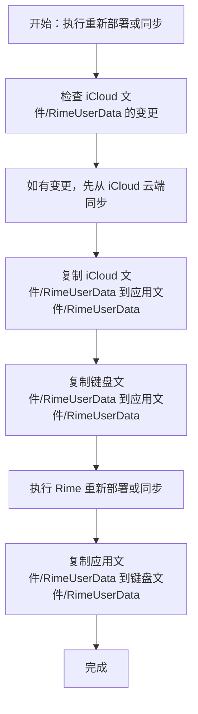

在元书中，Rime 相关文件可能存放在三个位置：**应用文件**、**键盘文件**和 **iCloud 文件**。

- **应用文件**：位于元书应用的沙盒目录中，可通过第三方文件管理或编辑应用查看、编辑，例如「文件」App、「Textastic」等。
  - 这是日常修改方案文件时最常用的目录。
- **键盘文件**：供键盘实际使用，位于系统的 App Group 目录中。受系统限制，其他应用无法直接访问，只能通过元书内置的文件管理功能查看或编辑。
  - 如果没有开启键盘的「完全访问」权限，键盘无法向此目录写入文件。
  - 如果需要保留自造词、调频等由键盘生成的数据，必须开启「完全访问」权限。
- **iCloud 文件**：位于 iCloud 的元书目录中，主要用于备份、同步方案文件和自造词等数据。

之所以区分「应用文件」和「键盘文件」，主要是为了兼顾以下使用场景：

1. 可以使用第三方文件编辑器修改方案文件；
2. 可以使用外部工具更新方案文件；
3. 键盘运行时仍然使用系统允许访问的专用目录。

如果只使用「键盘文件」目录，用户将无法在元书应用外部管理和编辑文件。

## 工作机制

由于文件可能分布在三个不同目录中，元书会在 Rime 每次执行「重新部署」或「同步」时，按固定顺序复制文件，以尽量保持各目录数据一致。



具体流程如下：

1. 检查 `iCloud 文件/RimeUserData` 目录下的文件变更状态；如果存在变更，先从 iCloud 云端同步这些变更文件。
2. 复制 iCloud 中的元书方案文件：等待第 1 步完成后，将 `iCloud 文件/RimeUserData` 下的文件复制到 `应用文件/RimeUserData`。
3. 复制键盘文件：等待第 2 步完成后，将 `键盘文件/RimeUserData` 下符合条件的文件复制到 `应用文件/RimeUserData`。
4. 执行「重新部署」或「同步」。
5. 操作完成后，将 `应用文件/RimeUserData` 下的文件复制到 `键盘文件/RimeUserData`。

:::tip[理解重点]
可以把:
- 「应用文件」理解为日常编辑和汇总的工作目录；
- 「键盘文件」是键盘运行时使用的目录；
- 「iCloud 文件」主要负责云端同步和备份。
:::

## 复制 iCloud 中的元书方案文件

从[工作机制](#工作机制)可以看到，元书会在每次「重新部署」或「同步」时，将 iCloud 中的元书方案文件从 `iCloud 文件/RimeUserData` 复制到 `应用文件/RimeUserData`。

此过程是强制执行的，目前没有开关可以关闭。若需要控制哪些 iCloud 文件不被复制，可以使用排除规则文件。

在 `应用文件/RimeSharedSupport` 目录下，有一个名为 `exclude_iCloud_rime_files.txt` 的文件。

该文件用于设置「从 iCloud 复制时需要排除的文件」的正则表达式，类似黑名单：匹配到的文件不会被复制。

默认内容如下：

```txt
# # 符号为注释
# 其余内容一行为一个正则表达式
.*[.]userdb.*$
.*[/]installation[.]yaml$
```

- `.*[.]userdb.*$`：不复制路径中包含 `.userdb` 的文件，即排除 `userdb` 文件。
- `.*[/]installation[.]yaml$`：不复制路径以 `installation.yaml` 结尾的文件。

用户可以根据需要修改此文件，添加或删除正则表达式，以控制 iCloud 文件的复制行为。

:::tip[提示]
- 正则表达式匹配时包含文件所在路径，因此请谨慎使用 `^`。
- 也可以将 `exclude_iCloud_rime_files.txt` 存放在方案目录下；元书会优先读取方案目录中的同名文件。
:::

## 复制键盘文件

从[工作机制](#工作机制)可以看到，元书会在每次「重新部署」或「同步」时，将 `键盘文件/RimeUserData` 下符合条件的文件复制到 `应用文件/RimeUserData`。

此过程默认开启，由「rime」->「禁止复制键盘文件」开关控制。

- 开关关闭：允许从「键盘文件」复制文件到「应用文件」。
- 开关开启：禁止从「键盘文件」复制文件到「应用文件」。

如果您不使用自造词，或者键盘不会生成任何需要保存的文件，可以开启此开关，禁止复制键盘文件。

如果您希望保留复制键盘文件的行为，同时控制哪些文件可以被复制，可以使用 `include_keyboard_rime_files.txt` 文件。

在 `应用文件/RimeSharedSupport` 目录下，有一个名为 `include_keyboard_rime_files.txt` 的文件。

该文件用于设置「允许从键盘文件复制的文件」的正则表达式，类似白名单：只有匹配到的文件才会被复制。

默认内容如下：

```txt
# # 符号为注释
# 其余内容一行为一个正则表达式
.*[.]userdb.*$
# 如果您使用 txt 类型自造词，可以取消此屏蔽
#.*[.]txt$
```

- `.*[.]userdb.*$`：复制路径中包含 `.userdb` 的文件，即复制自造词 `.userdb` 目录下的全部文件。
- `.*[.]txt$`：复制路径以 `.txt` 结尾的文件，即键盘文件下所有 `.txt` 文件。
  - 此行默认被注释。如果您使用 `.txt` 类型自造词，可以取消此行注释，即将 `#.*[.]txt$` 改为 `.*[.]txt$`（删除最前面的 # 符号）。

:::tip[提示]
- 正则表达式匹配时包含文件所在路径，因此请谨慎使用 `^`。
- 也可以将 `include_keyboard_rime_files.txt` 存放在方案目录下；元书会优先读取方案目录中的同名文件。
:::

## 常见问题

### 键盘无法保存自造词

键盘无法保存自造词，通常是因为没有开启键盘的「完全访问」权限。

如果开启键盘的「完全访问」权限后仍然无法保存自造词，请检查当前方案是否启用了自造词功能。

### 键盘生成的自造词无法同步

请先确认键盘可以正常保存自造词，具体可参考[键盘无法保存自造词](#键盘无法保存自造词)。如果确认保存正常，但自造词仍然无法同步，请检查以下几点：

1. 确认「rime」->「禁止复制键盘文件」开关是否关闭。若开启此开关，键盘文件不会被复制到「应用文件」目录，自然也无法参与同步。
2. 确认 `include_keyboard_rime_files.txt` 中是否包含自造词文件的匹配规则。
   - 默认规则已包含 `.*[.]userdb.*$`，可复制 `.userdb` 类型自造词。
   - 如果您使用 `.txt` 类型自造词，请取消 `#.*[.]txt$` 这一行的注释，即将 `#.*[.]txt$` 改为 `.*[.]txt$`（删除最前面的 # 符号）。

### 如何将键盘文件复制到应用目录

默认情况下，元书会在每次「重新部署」或「同步」时，将符合 `include_keyboard_rime_files.txt` 条件的键盘文件复制到应用目录。

如果需要复制更多类型的键盘文件，请在 `include_keyboard_rime_files.txt` 中添加相应的正则表达式。
