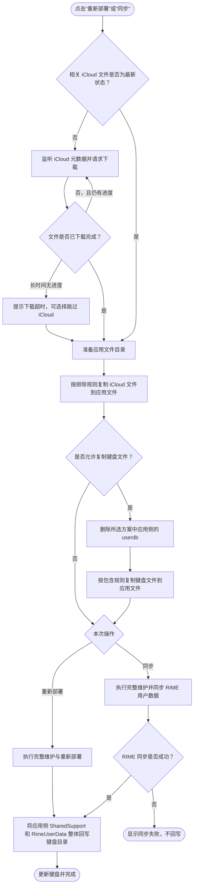

元书将 RIME 文件分别保存在“应用文件”“键盘文件”和“iCloud 文件”三个位置。三者用途不同，并不会持续实时同步；文件主要在执行“重新部署”“同步”或“复制文件至 iCloud”时按规则流转。

## 三类文件目录

| 目录 | 所在位置 | 主要用途 | 访问限制 |
| --- | --- | --- | --- |
| 应用文件 | 元书应用沙盒 | 日常管理和编辑方案，也是应用执行 RIME 操作时的工作目录 | 可通过系统“文件”App、Textastic 等支持文稿目录的第三方应用访问 |
| 键盘文件 | App Group 共享容器 | 供键盘扩展运行 RIME，并保存键盘产生的自造词、调频数据等 | 其他应用不能直接访问；需通过元书内置文件管理功能操作 |
| iCloud 文件 | iCloud 云盘中的元书目录 | 在设备间传递方案文件、备份文件和自造词等数据 | 受 iCloud 登录状态、网络和文件下载状态影响 |

:::caution[完全访问权限]
受 iOS 限制，未开启键盘的“完全访问”权限时，键盘扩展无法向 App Group 中的键盘文件目录写入数据。若要保留键盘产生的自造词和调频数据，请开启“完全访问”。
:::

之所以同时保留应用文件和键盘文件，是因为键盘扩展需要独立、稳定的运行目录，而应用文件又需要能够被外部文件工具编辑。如果只使用键盘文件，用户便无法在元书以外管理方案。

## 工作机制

“重新部署”和“同步”使用相同的文件准备流程：先确保所需的 iCloud 文件已经下载，再依次把 iCloud 文件和键盘产生的数据合并到应用文件。RIME 操作结束后，应用文件会整体回写到键盘目录。


```mermaid
flowchart TD
    start([点击“重新部署”或“同步”]) --> checkCloud{相关 iCloud 文件是否为最新状态？}
    checkCloud -->|否| requestDownload[监听 iCloud 元数据并请求下载]
    requestDownload --> downloadDone{文件是否已下载完成？}
    downloadDone -->|否，且仍有进度| requestDownload
    downloadDone -->|长时间无进度| timeout[提示下载超时，可选择跳过 iCloud]
    timeout --> prepare
    downloadDone -->|是| prepare[准备应用文件目录]
    checkCloud -->|是| prepare
    prepare --> cloudToApp[按排除规则复制 iCloud 文件到应用文件]
    cloudToApp --> keyboardEnabled{是否允许复制键盘文件？}
    keyboardEnabled -->|是| removeUserdb[删除所选方案中应用侧的 userdb]
    removeUserdb --> keyboardToApp[按包含规则复制键盘文件到应用文件]
    keyboardEnabled -->|否| chooseAction
    keyboardToApp --> chooseAction{本次操作}
    chooseAction -->|重新部署| deploy[执行完整维护与重新部署]
    chooseAction -->|同步| sync[执行完整维护并同步 RIME 用户数据]
    deploy --> appToKeyboard[将应用侧 SharedSupport 和 RimeUserData 整体回写键盘目录]
    sync --> syncSuccess{RIME 同步是否成功？}
    syncSuccess -->|是| appToKeyboard
    syncSuccess -->|否| failed([显示同步失败，不回写])
    appToKeyboard --> finish([更新键盘并完成])
```

### 1. 等待 iCloud 文件就绪

执行“重新部署”时，元书检查 `iCloud 文件/RimeUserData`；执行“同步”时，还会同时检查当前 RIME 同步目录。只要发现文件尚未下载或不是最新版本，元书便会监听 iCloud 文件状态并主动请求下载，待相关文件全部变为最新状态后再继续。

如果下载持续推进，等待计时会随进度刷新；若长时间没有进度，元书会停止等待并提示超时。用户选择跳过 iCloud 后，本次操作将直接使用设备上已有的本地文件，因此未下载的新版本不会参与本次合并。

### 2. iCloud 文件合并到应用文件

iCloud 文件就绪后，元书将 `iCloud 文件/RimeUserData` 复制到 `应用文件/RimeUserData`。这是覆盖式合并：命中排除规则的文件不会复制；其他文件若在目标位置已存在，会先删除旧文件再复制新文件。

复制规则由 `exclude_iCloud_rime_files.txt` 控制。该步骤属于“重新部署”和“同步”的固定流程，不能单独关闭。

### 3. 键盘数据合并到应用文件

当“RIME → 禁止复制键盘文件”处于关闭状态时，元书会：

1. 删除应用文件中当前所选方案目录下以 `userdb` 结尾的目录；
2. 按 `include_keyboard_rime_files.txt` 的包含规则，将匹配的键盘文件复制到应用文件。

先删除应用侧 `.userdb` 再复制，可以避免旧数据库残留与键盘侧数据混合。若开启“禁止复制键盘文件”，这两个步骤都会跳过。

### 4. 执行 RIME 操作

文件准备完成后，元书以应用文件作为用户数据目录启动 RIME：

- “重新部署”会执行完整维护和部署，然后关闭 RIME；
- “同步”会先执行完整维护，再调用 RIME 用户数据同步。只有同步返回成功，后续回写才会继续。

### 5. 应用文件回写键盘文件

操作成功后，元书会用应用侧的 `RimeSharedSupport` 和整个 `RimeUserData` 替换键盘侧对应目录，并更新键盘重启时间。键盘下次启动时即可使用最新方案和数据。

:::note[不是双向实时同步]
三个目录不会在每次文件编辑后立即互相同步。修改应用文件后，需要执行“重新部署”或“同步”才能更新键盘文件；将应用文件写入 iCloud，则需要使用“复制文件至 iCloud”。
:::

## 从 iCloud 复制方案文件

### 排除规则

`应用文件/RimeSharedSupport/exclude_iCloud_rime_files.txt` 是 iCloud → 应用文件的排除列表。每个非注释行都是一个正则表达式；路径命中任意一条规则时，该文件不会被复制。

默认内容如下：

```text
# # 符号开头的行为注释
# 其余内容一行为一个正则表达式
.*[.]userdb.*$
.*[/]installation[.]yaml$
```

- `.*[.]userdb.*$`：排除路径中包含 `.userdb` 的文件；
- `.*[/]installation[.]yaml$`：排除以 `/installation.yaml` 结尾的文件。

:::tip[规则文件优先级]
若当前所选方案目录中存在 `exclude_iCloud_rime_files.txt`，元书会优先使用它；否则使用 `应用文件/RimeSharedSupport` 中的同名文件。匹配对象是文件的完整路径，因此使用 `^` 时需要特别谨慎。
:::

## 从键盘复制文件

### 包含规则

`应用文件/RimeSharedSupport/include_keyboard_rime_files.txt` 是键盘文件 → 应用文件的包含列表。只有路径命中至少一条正则表达式的文件才会被复制。

默认内容如下：

```text
# # 符号开头的行为注释
# 其余内容一行为一个正则表达式
.*[.]userdb.*$
# 如果您使用 txt 类型自造词，可以取消下一行的注释
#.*[.]txt$
```

- `.*[.]userdb.*$`：复制路径中包含 `.userdb` 的文件，即 RIME 自造词数据库；
- `.*[.]txt$`：复制所有 `.txt` 文件。该规则默认被注释；使用 TXT 格式自造词时可取消注释。

:::tip[规则文件优先级]
若当前所选方案目录中存在 `include_keyboard_rime_files.txt`，元书会优先使用它；否则使用 `应用文件/RimeSharedSupport` 中的同名文件。请注意文件名中的 `files` 为复数。
:::

## 将应用文件复制到 iCloud

RIME 菜单中的“复制文件至 iCloud”会将当前所选方案目录下符合规则的文件复制到 `iCloud 文件/RimeUserData`。

“所选方案目录”由“输入方案 → 方案目录切换”控制，默认为 `RimeUserData/rime-ice`。复制范围由 `include_iCloud_rime_files.txt` 控制：它采用包含列表机制，只有路径命中其中正则表达式的文件才会复制；目标位置存在同名文件时会被替换。

与“重新部署”“同步”开始时自动执行的 iCloud → 应用文件复制不同，“复制文件至 iCloud”是需要用户主动触发的反向复制操作。

:::caution[重置规则文件]
“复制文件至 iCloud”需要 1.6.17 或更高版本，或 TestFlight 370 或更高版本。若 `RimeSharedSupport` 中缺少 `include_iCloud_rime_files.txt`，可通过 RIME 菜单中的“重置”恢复；但“重置”还会同时恢复 `RimeSharedSupport` 的全部文件，以及 `RimeUserData/rime-ice` 内置雾凇方案的全部文件，请先备份自己的修改。
:::

## 正则规则的解析方式

三个规则文件遵循相同格式：

- 每行一个正则表达式；
- 行首为 `#` 的行会被忽略；
- 无法解析的正则表达式会被忽略；
- 正则表达式匹配的是源文件完整路径，而不只是文件名。

## 常见问题

### 键盘无法保存自造词

最常见的原因是没有开启键盘的“完全访问”权限。开启后若仍无法保存，请继续检查当前方案是否启用了自造词功能。

### 键盘生成的自造词无法进入应用文件

请依次检查：

1. 键盘能否正常保存自造词；
2. “RIME → 禁止复制键盘文件”是否处于关闭状态；
3. `include_keyboard_rime_files.txt` 是否包含自造词文件对应的正则表达式；
4. 使用 TXT 自造词时，是否已经启用 `.*[.]txt$` 规则；
5. 修改规则后，是否重新执行了“重新部署”或“同步”。

### 如何将键盘文件复制到应用目录

在 `include_keyboard_rime_files.txt` 中添加相应的正则表达式，然后执行“重新部署”或“同步”。元书会把命中规则的键盘文件合并到应用目录。

### 修改应用文件后，键盘为什么没有变化

应用文件不是键盘的实时工作目录。修改完成后，请执行“重新部署”或“同步”，让元书处理方案并将结果回写到键盘文件目录。
