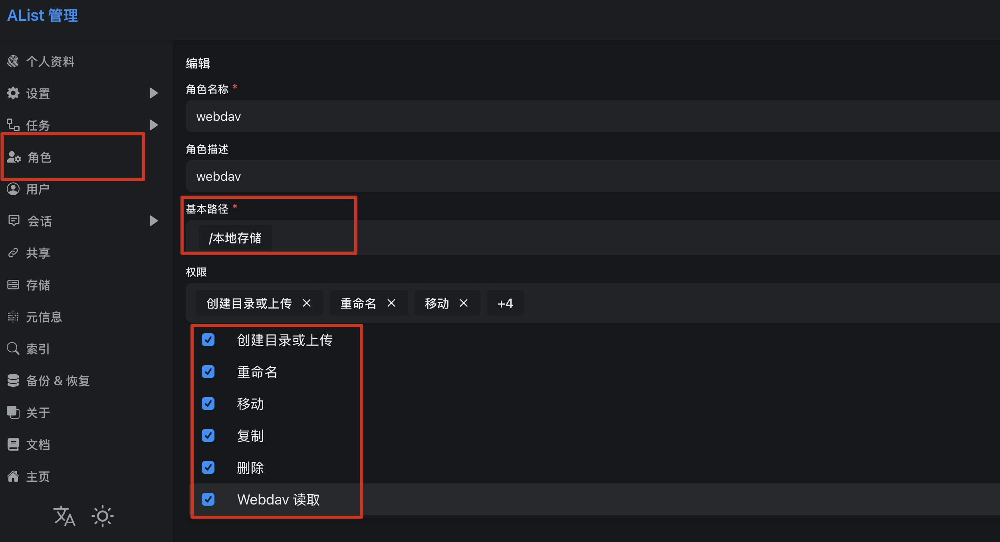
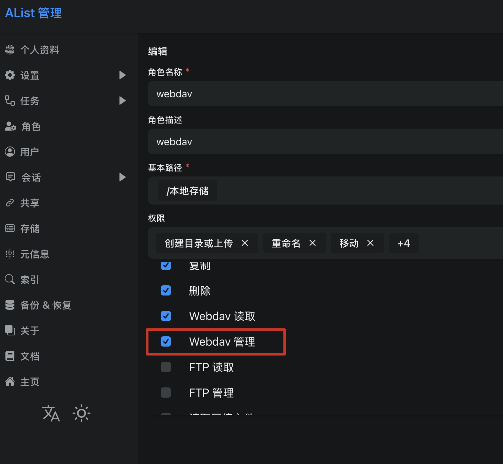
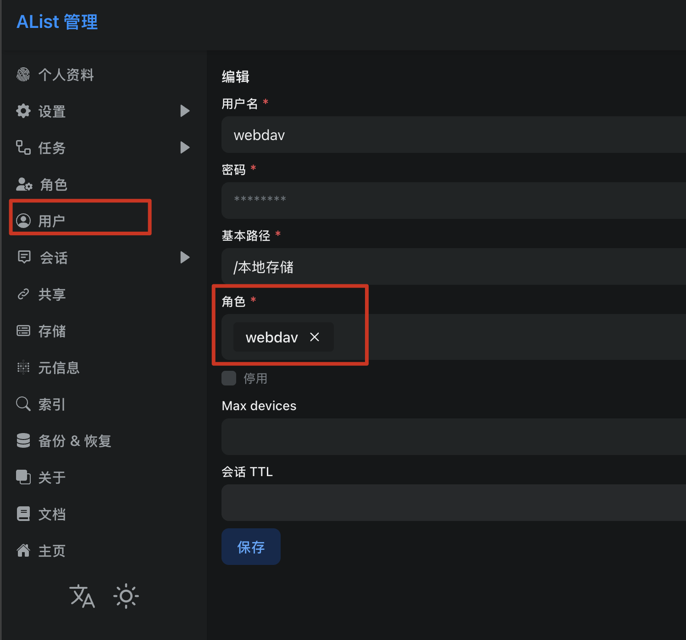

:::tip[注意]
- 此功能在 1.10.0 之后的版本中提供
- 此功能仅在坚果云和自建 AList 服务中做过测试，其他网络 WebDAV 服务没测试过，可能不兼容。
  如遇到问题，可发邮件反馈问题。
:::

「网络存储」为元书提供了 iCloud 之外的第二条云端通道：可「应用」目录下的文件**上传**到 WebDAV 的服务器、或从服务器**下载**回来。


## 此功能的缺陷及与 iCloud 的不同

网络存储与 iCloud 的区别：它不具备 iCloud 的 **合并文件冲突或删除的文件**、**自动下载上传**等功能。网络存储的上传与下载是**单向**，且需要手工触发：

| 动作 | 含义 | 结果 |
| --- | --- | --- |
| 上传 | **单向推送**，以本地为准 | 把「应用」目录下的文件写到服务器对应位置，**同名覆盖**；<br />服务器上多出来的文件**原样保留** |
| 下载 | **单向拉取**，以远端为准 | 把服务器上的文件写到「应用」目录对应位置，**同名覆盖**；<br />本地多出来的文件**原样保留** |

且这两个动作只在你手动触发时执行，

:::danger[这不是双向同步]

举例：如果在 A、B 两台设备上分别修改了同一个文件，然后 A 先上传，

此时 B 是不知道服务端已经修改了文件，B 也不会自动合并修改后的文件。

所以当 B 上传时就会**覆盖** A 的改动，整个过程不可逆且无法恢复。

请把它理解为「把我这台设备的现状推上去」/「拿服务器上的内容覆盖我这台设备」。
:::

## 添加网络存储

1. 在应用首页「方案」分组中打开「网络存储」；
2. 点右上角 **＋**，从模板中选择一项：

| 模板 | 事项 |
| --- | --- |
| 坚果云 | 默认坚果云的参数已经按免费用户调整过了，只需要填写**用户名**、**密码**。<br />如果你是付费用户，可以调高**请求配额**，能加快上传或下载的速度。 |
| 自定义 WebDAV | 默认约束参数全为 `0`（即无约束），可按实际情况调整 |

注意：

- 远端根目录默认为 `/`，表示上传到 WebDAV 服务器的根目录下；如果你想存储到别的位置，请调整此参数。

### 表单字段

| 字段 | 说明 |
| --- | --- |
| 显示名称 | 列表中显示的名称。**不能为空，也不能与其他网络存储重名（忽略大小写）** |
| 服务器地址 | WebDAV 地址，如 `https://dav.jianguoyun.com/dav/`。<br />局域网自建服务可以直接用 `http://` |
| 用户名 | 登录账号；坚果云为账号邮箱 |
| 密码 | 见下方提示 |
| 远端根目录 | 默认为 `/`。建议使用一个子目录，例如 `/元书` |
| 设为默认 | 有且仅能设置一个默认的网络存储 |

:::caution[很多服务商要用「应用密码」]
部分服务商（如坚果云）的 WebDAV 密码**不是登录密码**，而是单独生成的应用密码。

坚果云是在应用下的「设置 → 第三方应用管理 → 添加应用授权」，会生成一个授权码。

配好后连接测试报「账号或密码错误」，绝大多数情况就是这个原因。
:::

:::danger[远端根目录不建议用默认的`/`]
远端根目录决定文件落在服务器的哪个位置。如果留空或填 `/`，上传会**直接往服务器地址所指的那个目录里铺一层** `RimeUserData/`、`Skins/`、`Fonts/`，并覆盖其中的同名项。

建议指定一个专用子目录（如 `元书`），最终路径为「服务器地址 + 远端根目录」，例如 `https://dav.jianguoyun.com/dav/` + `元书` → `https://dav.jianguoyun.com/dav/元书/`。
:::

### AList 设置

根据 AList [官方文档](https://alistgo.com/zh/guide/webdav.html)。

需要为登录账号授权 WebDAV 管理权限，此外还需要创建目录、上传、删除、重命名、移动、复制等权限。

权限是通过角色授予的，然后在将角色与登录账号绑定。

角色：




账号：



设置成功后，WebDAV 访问地址需加后缀 `/dav`，如 `http://10.10.10.20:5244/dav/`

### 服务商约束参数

表单下半部分是服务商的约束参数。**取值 `0` 表示「无此约束」**。自建服务器通常全部保持 `0`。

| 参数 | 说明 | 坚果云取值 |
| --- | --- | --- |
| 请求配额 | 滑动窗口内允许的请求数，`0` 表示不限 | 坚果云免费用户 600，付费用户 1500。自建WebDAV可设置为0。<br /> 合适的参数可提高上传/下载速度。 |
| 配额窗口（秒） | 与请求配额配套的滑动窗口长度 | 1800（30 分钟） |
| 单文件上传上限（MB） | 超限的文件直接跳过并记入失败清单，不会白白浪费一次请求 | 500 |
| 单次列目录条数上限 | 达到上限时列表会提示「内容可能未完整加载」 | 750 |
| 重试次数 | 收到 `429` / `503` 后的重试次数 | 默认 3 |
| 退避基数（秒） | 指数退避的基数；服务端返回 `Retry-After` 时以服务端为准 | 默认 2.0 |
| 请求超时（秒） | 单个请求的超时时间 | 默认 30.0 |

配额填写的原则是**宁低勿高**：填低了只是传得慢一点，填高了会撞上服务商限流，代价是账号被晾一段时间。坚果云免费用户升级为付费后，把「请求配额」改成 1500 即可，不需要重建。

:::note[元书不认识任何服务商]
元书代码里没有针对某个服务商的特殊处理，所有差异都是上面这几个参数的数值。请根据自己的服务商调整上述参数。
:::

### 连接测试

保存后，在列表中**点一下这一行**，选择「连接测试」。一次测试同时验证四件事：网络可达、TLS 握手成功、账号密码正确、**远端根目录存在且有权限**。

## 目标

网络存储页面中间有一块「目标 + 上传文件 / 下载文件」功能区。

- **目标**标题显示本次操作的对象，默认选中网络存储中的默认项；点击可切换到任意一个网络存储对象；
- 临时切换**只影响本次操作**，不会改变默认的网络存储设置。


### 上传文件

点击「上传文件」，会将「应用」目录下的全部文件按当前「目标」的「上传黑名单」过滤，再把过滤后的文件上传到服务端。

### 下载文件

与「上传文件」相反，它会依据当前「目标」的「下载黑名单」过滤服务端文件，再把过滤后的文件下载到「应用」目录下。

:::caution[注意]
- 上传/下载行为是「只增改不删」。
  - 本地删掉的文件，在上传后，服务器上相同位置文件不会被删除。
  - 云端删掉的文件，在下载后，本地相同位置文件不会被删除。
- 下载结束后如果方案文件发生变化，需要手工部署 RIME。如果皮肤、字体发生变化，也需要手工调整对应的功能。
:::

## 黑名单

「上传哪些、下载哪些」由两份**互相独立**的正则名单控制，**每个网络提供商各有一份**，可直接在它的编辑页里编辑：

- **上传黑名单**：匹配到的本地文件不会上传；
- **下载黑名单**：匹配到的远端文件不会下载。

### 语法

与 `exclude_iCloud_rime_files.txt` 完全一致：

- 一行一条**正则表达式**；
- `#` 开头为注释，空行忽略；
- **部分匹配**，不需要写全路径；

### 匹配对象

匹配的是**相对根目录的路径**，**不带前导 `/`，目录带尾随 `/`**：

- 上传时，根是「应用」目录（即 `Documents/`），例如 `RimeUserData/luna_pinyin.userdb/`；
- 下载时，根是这项网络存储的远端根目录。

:::tip[命中目录则子目录也会跳过]
带尾随 `/` 的目录路径也参与匹配，**命中表示当前目录的子目录也被排除，不再向下查找文件或目录**。
:::

## 浏览远端文件

在网络服务列表中点具体的供应商，然后选择「文件浏览」，即可浏览服务器上的文件。

浏览文件功能提供**两个操作：删除、下载**，没有新建、改名、复制、移动与文本编辑。

- 浏览从远端根目录开始，**不能浏览根目录的父级目录内容**；
- 列表行左滑：**删除**（二次确认，服务器上的文件会被永久删除）、**下载**；

注意下载是**按相对路径**：远端 `<根>/RimeUserData/a.schema.yaml` 会落到本机「应用」目录的 `RimeUserData/a.schema.yaml`。

## 从「文件管理」页上传文件

在「文件管理」页对某一行**左滑**或长按，会出现「上传到 xx」（xx 为默认网络存储的名称），点击后会把该文件或目录上传到**默认网络存储**。

这一项只在已设置默认网络存储时才会出现，否则完全不显示。

## 传输进度与结果

传输页会显示总进度、当前文件名，以及**成功 / 跳过 / 失败**三个计数。

:::caution[注意]
- 传输期间屏幕不能锁屏或切后台，此行为会中断传输；
:::

## 日志

网络存储页底部的「日志」记录每一次传输的具体情况

## 通过 URL 调起

网络存储支持用 URL 直接按下页面上的「上传」/「下载」按钮，可配合键盘菜单、命令面板或快捷指令使用：

```text
hamster3://com.ihsiao.apps.hamster3/remoteStorage
hamster3://com.ihsiao.apps.hamster3/remoteStorage?action=upload
hamster3://com.ihsiao.apps.hamster3/remoteStorage?action=download&provider=坚果云
```

| 参数 | 必填 | 取值 | 行为 |
| --- | --- | --- | --- |
| `action` | 是 | `upload` / `download` | 缺省或取值不认识时**只跳到网络存储页**，不做任何动作、不给任何提示 |
| `provider` | 否 | 网络存储的显示名称 | 省略或留空时用默认网络存储；匹配时忽略首尾空白与大小写 |

说明：

- `provider=` 指定了一个**不存在**的名称时，元书**不执行、也不退回默认**，只提示「未找到名为『xxx』的网络存储」。没有默认网络存储时同理，提示「尚未设置默认网络存储」。

## 已知限制

| 项 | 说明 |
| --- | --- |
| 单向覆盖会丢改动 | 两台设备同时修改并上传，后一次上传会静默覆盖前一次上传内容。无提示、无撤销 |
| 远端会积累垃圾 | 上传只增改文件，不删文件，本地删掉的文件永远留在服务器上，清理靠手动删除 |
| 切到后台即中断 | 应用退到后台，上传或下载任务会立即停止 |
| 单目录超过条数上限会被截断 | WebDAV 协议本身没有分页机制。元书的处理是**检测并警告**（列表顶部提示「此目录内容可能未完整加载」） |

## 常见问题

### 连接测试报「账号或密码错误」

先确认用的是不是**应用密码**。坚果云等服务商的 WebDAV 密码需要单独生成，而不是登录密码。

### 连接测试报「无法连接到服务器」

依次检查：服务器地址是否完整（含 `http://` 或 `https://`）、地址是否为 WebDAV 入口（如 AList 需要加 /dav/）而不是网页版地址。

### 下载完成了，键盘上却没变化

键盘读取的不是「应用」目录，而是部署时复制过去的副本。

下载完成的方案、皮肤等，请前往「RIME」页面执行**重新部署**，或者皮肤页面重新设置皮肤。

### 为什么我改过的雾凇方案没有上传

默认上传黑名单里有 `^RimeUserData/rime-ice/`（内置方案每台设备装完即有，上传纯属浪费配额）。如果你直接改了内置雾凇方案并希望同步，请在这项网络存储的上传黑名单里删掉这一行。内置皮肤同理。

### 为什么自造词没有被传上去

`.*[.]userdb.*$` 默认在两份黑名单里都屏蔽。userdb 自造词库是数据库目录，整目录跨设备覆盖可能导致词频错乱甚至损坏。要跨设备同步自造词，请用 RIME 自己的同步机制（`sync/` 目录下的 `.userdb.txt` 快照），参见[如何通过 iCloud 同步 RIME 自造词](/apps/hamster/v3/docs/guides/faqs/rime-user-words-sync/)。

确实想自己承担风险时，删掉两份名单里的这一行即可。

### 传输卡在「已达服务商请求配额，等待 …」

这不是卡死。元书按你填写的配额主动限速，窗口内没用满配额时全速跑，接近上限才开始等待最早的请求滑出窗口——这样才不会撞上服务商限流。等待结束会自动继续。

如果经常等待，可以：把用不到的目录加进上传黑名单（少传就少发请求）、升级服务商套餐后把「请求配额」改大，或换用不限流的自建服务（把约束参数全填 `0`）。

注意浏览远端文件、连接测试、删除、单项下载**同样计入配额**。

### 保存时提示「显示名称已存在」

网络存储中的名称必须唯一（忽略大小写）
